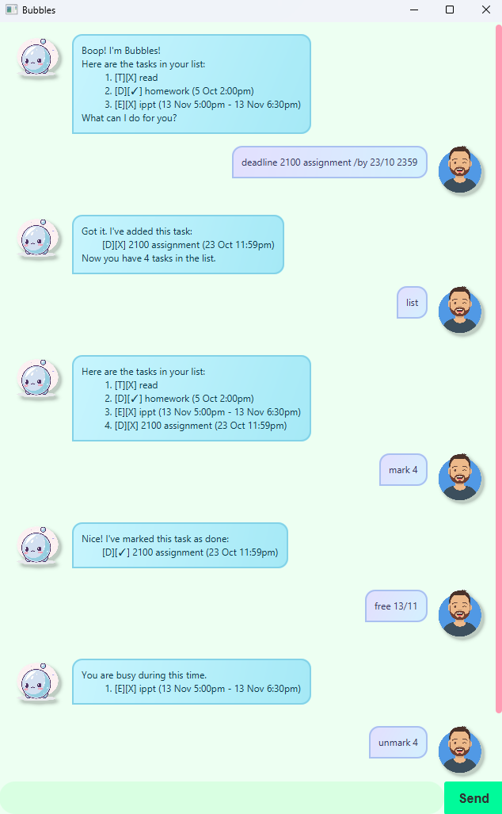

# Bubbles User Guide

> "Your thoughts are bubbles waiting to be popped." - Jon Kabat-Zinn

Introducing Bubbles, your personal chatbot that will **blow** you away. It is
- text-based
- ~~relatively~~ easy to learn
- poppable 🫧



## How can I start blowing bubbles?
It's easy!
<br>
1. Ensure that you have Java `17` or above installed.
2. Download it from [here](https://github.com/hongxun03/ip/releases). 
3. Double-click the file

and you are ready to start blowing some bubbles!

## Features
> [!IMPORTANT]
> Text within angled brackets `<>` are placeholders for your input. 
> <br>
> For example, in `todo <DESCRIPTION>`, DESCRIPTION refers to the description of your todo task.

These are the current features implemented.
1. [Adding a todo task](#adding-a-todo-task)
2. [Adding a deadline task](#adding-a-deadline-task)
3. [Adding an event task](#adding-an-event-task)
4. [List](#listing-all-your-tasks)
5. [Free](#checking-whether-you-are-free)
6. [Find](#finding-specific-tasks)
7. [Mark](#marking-tasks)
8. [Unmark](#unmarking-tasks)
9. [Delete](#deleting-tasks)
10. [Exit](#exiting-the-program)


### Adding a todo task:
Add a todo task to your task list.

#### Format: `todo <DESCRIPTION>`

Example: `todo buy birthday gift`

Expected output:
```
Got it. I've added this task:
    [T][X] buy birthday gift
Now you have 1 task in the list.
```

### Adding a deadline task:
Add a deadline task to your task list.

#### Format: `deadline <DESCRIPTION> /by <DATE-TIME>`
> [!IMPORTANT]
> `DATE-TIME` needs to be in the following format: DD/MM hh:mm.
> <br>
> The year is assumed to be the current year.

> [!NOTE]
> The chatbot will throw you an error message if your date/time is out of bounds.

Example: `deadline pay tax bills /by 13/5 1400`

Expected output:
```
Got it. I've added this task:
    [D][X] pay tax bills (13 May 2:00pm)
Now you have 2 tasks in the list.
```

### Adding an event task:
Add an event task to your task list.

> [!IMPORTANT]
> `DATE-TIME` needs to be in the following format: DD/MM hh:mm.
> <br>
> The year is assumed to be the current year.

> [!NOTE]
> The chatbot will throw you an error message if 
> 1. your start date/time is not before your end date/time.
> 2. your date/time is out of bounds.

#### Format: `event <DESCRIPTION> /from <DATE-TIME> /to <DATE-TIME>`

Example: `event hackathon /from 5/6 1200 /to 12/6 2359`

Expected output:
```
Got it. I've added this task:
    [E][X] hackathon (5 Jun 12:00pm - 12 Jun 11:59pm)
Now you have 3 tasks in the list.
```

### Listing all your tasks:
Displays a list of all your current tasks.

#### Format: `list`

Expected output:
```
Here are the tasks in your list:
    1. [T][X] buy birthday gift
    2. [D][X] pay tax bills (13 May 2:00pm)
    3. [E][X] hackathon (5 Jun 12:00pm - 12 Jun 11:59pm)
```

### Checking whether you are free:
Tells you if you are free during the specified time. If there are clashing tasks, Bubbles will list them.

#### Format: `free <KEYWORD> <DATE>` or `free <KEYWORD> <DATE> - <DATE>`

> [!IMPORTANT]
> `DATE-TIME` needs to be in the following format: DD/MM.
> <br>
> The year is assumed to be the current year.

> [!NOTE]
> The chatbot will throw you an error message if
> 1. your start date/time is not before your end date/time.
> 2. your date/time is out of bounds.

Example: `free 13/5`

Expected output:
```
You are busy during this time:
    1. [D][X] pay tax bills (13 May 2:00pm)
```

### Finding specific tasks:
Displays a list of tasks that matches your keyword.

#### Format: `find <KEYWORD>`

> [!NOTE]
> The KEYWORD argument is case-sensitive.

Example: `find birthday`

Expected output:
```
There are 1 matching tasks in your list:
    1. [T][X] buy birthday gift
```

### Marking tasks:
Sets the specified task as completed.

#### Format: `mark <TASK-NUMBER>`

> [!NOTE]
> The TASK-NUMBER ranges from 1 to total number of tasks.

Example: `mark 1`

Expected output:
```
Nice! I've marked this task as done:
    [T][✓] buy birthday gift
```

### Unmarking tasks:
Sets the specified task as uncompleted.

#### Format: `unmark <TASK-NUMBER>`

> [!NOTE]
> The TASK-NUMBER ranges from 1 to total number of tasks.

Example: `unmark 1`

Expected output:
```
OK, I've marked this task as not done yet:
    [T][X] buy birthday gift
```

### Deleting tasks:
Deletes the specified task from memory.

#### Format: `delete <TASK-NUMBER>`

> [!NOTE]
> The TASK-NUMBER ranges from 1 to total number of tasks.

Example: `delete 2`

Expected output:
```
Noted, I've deleted this task from your list:
    [D][X] pay tax bills (13 May 2:00pm)
Now you have 2 tasks remaining.
```

### Exiting the program:
Exits the program.

#### Format: `bye`

> [!TIP]
> You can also click on the X button at the top right.

## Saving the data
Tasks and any edits to them (e.g. mark/delete) are saved in the hard disk automatically after every command.
<br>
There is no need to save manually.